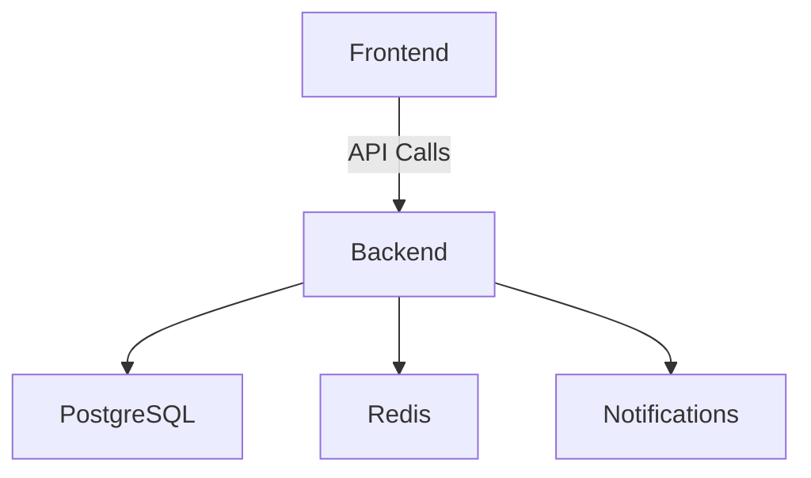

# Architecture Overview

## System Design

The Badminton Tournament Hub is designed to offer robust tournament management capabilities through a microservices architecture. The key components include:

- **Authentication Service**: Handles user registration, login, and JWT-based authentication.
- **Tournament Service**: Manages tournament creation, scheduling, and participant tracking.
- **Notification Service**: Sends real-time updates and notifications to users.

## Component Descriptions

- **Backend**: Built with FastAPI, the backend provides RESTful API endpoints for managing users, tournaments, and scores.
- **Frontend**: A responsive web application developed using Next.js and TypeScript, providing a user-friendly interface for tournament organizers, players, and umpires.
- **Database**: Utilizes PostgreSQL for persistent storage of user data and tournament details, with Redis for caching frequently accessed data.

## Data Flow

