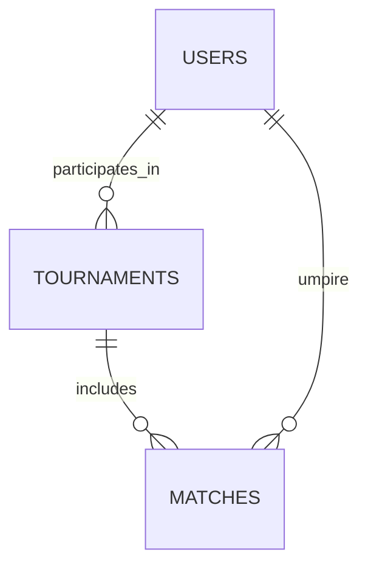

# Database Schema

## Schema Overview

The database is structured to store user information, tournament details, match schedules, and scores.

- **Users**: Stores information about all registered users, including email, password hash, and roles.
- **Tournaments**: Contains details of each tournament such as name, location, and participant limit.
- **Matches**: Records the schedule and results of matches within tournaments.

## Entity Relationships



## Migration Guide

Alembic is used to manage database migrations.

1. **Create a Migration**
   ```bash
   alembic revision --autogenerate -m "description"
   ```

2. **Apply Migrations**
   ```bash
   alembic upgrade head
   ```